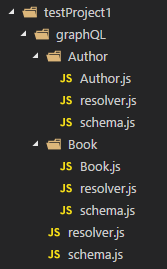
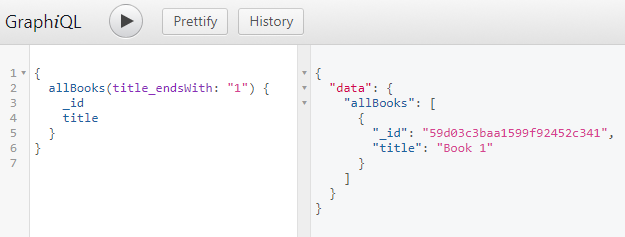

[](https://www.npmjs.com/package/mongo-graphql-starter)
[](https://codecov.io/gh/arackaf/mongo-graphql-starter)
[](https://github.com/prettier/prettier)


# mongo-graphql-starter

This utility will scaffold GraphQL schema and resolvers, with queries, filters and mutations working out of the box, based on metadata you enter about
your Mongo db.

The idea is to auto-generate the mundane, repetitive boilerplate needed for a graphQL endpoint, then get out of your way, leaving you to code anything else you need. 

<!-- TOC -->

- [Prior art](#prior-art)
- [How do you use it?](#how-do-you-use-it)
  - [Valid types for your fields](#valid-types-for-your-fields)
  - [Readonly types](#readonly-types)
  - [Circular dependencies are fine](#circular-dependencies-are-fine)
- [VS Code integration](#vs-code-integration)
- [TypeScript integration](#typescript-integration)
- [Queries created](#queries-created)
  - [Projecting results from queries](#projecting-results-from-queries)
  - [Fragment support](#fragment-support)
  - [Custom query arguments](#custom-query-arguments)
- [Filters created](#filters-created)
  - [null values](#null-values)
  - [String filters](#string-filters)
  - [String array filters](#string-array-filters)
  - [Int filters](#int-filters)
  - [Int array filters](#int-array-filters)
  - [Float filters](#float-filters)
  - [Float array filters](#float-array-filters)
  - [Date filters](#date-filters)
  - [Formatting dates](#formatting-dates)
  - [OR Queries](#or-queries)
  - [Nested object and array filters](#nested-object-and-array-filters)
  - [Sorting](#sorting)
  - [Paging](#paging)
- [Mutations](#mutations)
  - [Creations](#creations)
  - [Updates](#updates)
    - [The Updates argument](#the-updates-argument)
  - [Deleting](#deleting)
  - [Mutation examples](#mutation-examples)
- [Transactions](#transactions)
- [Integrating custom content](#integrating-custom-content)
  - [schemaSources example](#schemasources-example)
  - [resolverSources example](#resolversources-example)
  - [Adding Arbitrary Schema and Resolver Content](#adding-arbitrary-schema-and-resolver-content)
- [Defining relationships between types](#defining-relationships-between-types)
  - [Using relationships](#using-relationships)
  - [Implementation](#implementation)
  - [Creating related data](#creating-related-data)
    - [In creations](#in-creations)
    - [In updates (not one-to-many)](#in-updates-not-one-to-many)
    - [In updates (one-to-many)](#in-updates-one-to-many)
    - [In lifecycle hooks](#in-lifecycle-hooks)
- [Lifecycle hooks](#lifecycle-hooks)
  - [All available hooks](#all-available-hooks)
    - [The `queryPacket` argument to the queryMiddleware hook](#the-querypacket-argument-to-the-querymiddleware-hook)
  - [How to define hooks](#how-to-define-hooks)
    - [Customizing the location of your hooks file.](#customizing-the-location-of-your-hooks-file)
    - [Doing asynchronous processing in hooks.](#doing-asynchronous-processing-in-hooks)
    - [Reusing code across types' hooks](#reusing-code-across-types-hooks)
- [A closer look at what's generated](#a-closer-look-at-whats-generated)
- [Run tests](#run-tests)

<!-- /TOC -->

## Prior art

This project is heavily inspired by [Graph.Cool](https://www.graph.cool/). It was an amazing graphQL-as-a-service that got me hooked on the
idea of auto-generating a graphQL endpoint on your data store. The only thing I disliked about it was that you lost control of your data.
You lacked the ability to connect directly to your database and index tune, bulk insert data, bulk update data, etc. This project aims to provide the
best of both worlds: your graphQL endpoint is auto generated, but on top of the database you provide, and by extension retain control of. And integrating
your own arbitrary content is directly supported.

## How do you use it?

Let's work through a simple example.

**NOTE:** All of the code below assumes you're using John Dalton's [ESM loader](https://github.com/standard-things/esm). **Do not** try to run this code with Node's native ESM.

First, create your db metadata like this. Each mongo collection you'd like added to your GraphQL endpoint needs to contain the table name, and all of
the fields, keyed off of the data types provided. If you're creating a type which will only exist inside another type's Mongo fields, then you can
omit the table property.

For any type which is contained in a Mongo collection—ie has a `table` property—if you leave off the `_id` field, one will be added for you, of type
`MongoIdType`. Types with a `table` property will hereafter be referred to as "queryable."

**projectSetupA.js**

```javascript
import { dataTypes } from "mongo-graphql-starter";
const {
  MongoIdType,
  MongoIdArrayType,
  StringType,
  StringArrayType,
  BoolType,
  IntType,
  IntArrayType,
  FloatType,
  FloatArrayType,
  DateType,
  arrayOf,
  objectOf,
  formattedDate,
  JSONType,
  typeLiteral
} = dataTypes;

export const Author = {
  fields: {
    name: StringType,
    birthday: DateType
  }
};

export const Book = {
  table: "books",
  fields: {
    _id: MongoIdType,
    title: StringType,
    pages: IntType,
    weight: FloatType,
    keywords: StringArrayType,
    editions: IntArrayType,
    prices: FloatArrayType,
    isRead: BoolType,
    mongoIds: MongoIdArrayType,
    authors: arrayOf(Author),
    primaryAuthor: objectOf(Author),
    strArrs: typeLiteral("[[String]]"),
    createdOn: DateType,
    createdOnYearOnly: formattedDate({ format: "%Y" }),
    jsonContent: JSONType
  }
};

export const Subject = {
  table: "subjects",
  fields: {
    _id: MongoIdType,
    name: StringType
  }
};
```

Now create your schema and resolvers

```javascript
import { createGraphqlSchema } from "mongo-graphql-starter";
import * as projectSetup from "./projectSetupA";

import path from "path";

createGraphqlSchema(projectSetup, path.resolve("./test/testProject1"));
```

There should now be a graphQL folder containing schema, resolver, and type metadata files for your types, as well as a master resolver and schema
file, which are aggregates over all the types.



Now tell Express about it—and don't forget to add a root object with a `db` property that resolves to a connection to your database. If you're on Mongo 4 or higher, be sure to also add a `client` property that resolves to your Mongo client instance, which will be used to create sessions and transactions, for multi-document operations. 

If needed, `db` and `client` can be functions which returns a promise resolving to those things.

Here's what a minimal, complete example might look like.

```javascript
import { MongoClient } from "mongodb";
import expressGraphql from "express-graphql";
import resolvers from "./graphQL/resolver";
import schema from "./graphQL/schema";
import { makeExecutableSchema } from "graphql-tools";
import express from "express";

const app = express();

const mongoClientPromise = MongoClient.connect(connString, { useNewUrlParser: true });
const mongoDbPromise = mongoClientPromise.then(client => client.db(dbName));

const root = { client: mongoClientPromise, db: mongoDbPromise };
const executableSchema = makeExecutableSchema({ typeDefs: schema, resolvers });

app.use(
  "/graphql",
  expressGraphql({
    schema: executableSchema,
    graphiql: true,
    rootValue: root
  })
);
app.listen(3000);
```

Now `http://localhost:3000/graphql` should, assuming the database above exists, and has data, allow you to run queries.



### Valid types for your fields

Here are the valid types you can import from `mongo-graphql-starter`

```javascript
import { dataTypes } from "mongo-graphql-starter";
const {
  MongoIdType,
  MongoIdArrayType,
  StringType,
  StringArrayType,
  BoolType,
  IntType,
  IntArrayType,
  FloatType,
  FloatArrayType,
  DateType,
  arrayOf,
  objectOf,
  formattedDate,
  JSONType,
  typeLiteral
} = dataTypes;
```

| Type               | Description  |
| ------------------ | ------------------------------------ |
| `MongoIdType`      | Will create your field as a string, and return whatever Mongo uid that was created. Any filters using this id will wrap the string in Mongo's `ObjectId` function.  | 
| `MongoIdArrayType` | An array of mongo ids |
| `BoolType`         | Self explanatory       |
| `StringType`       | Self explanatory       |
| `StringArrayType`  | An array of strings    |
| `IntType`          | Self explanatory       |
| `IntArrayType`     | An array of integers   |
| `FloatType`        | Self explanatory       |
| `FloatArrayType`   | An array of floating point numbers |
| `DateType`         | Will create your field as a string, but any filters against this field will convert the string arguments you send into a proper date object, before passing to Mongo. Querying this date will by default format it as `MM/DD/YYYY`. To override this, use `formattedDate`. |
| `formattedDate`    | Function: Pass it an object with a format property to create a date field with that (Mongo) format. For example, `createdOnYearOnly: formattedDate({ format: "%Y" })` |
| `JSONType`         | Store arbitrary json structures in your Mongo collections |
| `objectOf`         | Function: Pass it a type you've created to specify a single object of that type |
| `arrayOf`          | Function: Pass it a type you've created to specify an array of that type |
| `typeLiteral`      | Function: pass it an arbitrary string to specify a field of that GraphQL type. The field will be available in queries, but no filters will be created, though you can add your own to the generated code.         |

### Readonly types

Add `readonly: true` to any type if you want only queries, and no mutations (both discussed below) created.

### Circular dependencies are fine

Feel free to have your types reference each other.  Just use a getter to reference types created downstream. For example, the following will generate a valid schema. 

```javascript
import { dataTypes } from "mongo-graphql-starter";
const { MongoIdType, StringType, arrayOf } = dataTypes;

export const Tag = {
  table: "tags",
  fields: {
    _id: MongoIdType,
    tagName: StringType,
    get authors() {
      return arrayOf(Author);
    }
  }
};

export const Author = {
  table: "authors",
  fields: {
    name: StringType,
    tags: arrayOf(Tag)
  }
};
```

## VS Code integration

At the root of the GraphQL folder that's created with your endpoint code, there should be an `entireSchema.gql` file. You can configure the VS Code GraphQL plugin to use it to validate, and provide auto-complete inside your `.graphql` files.  Check the [plugin's docs](https://marketplace.visualstudio.com/items?itemName=GraphQL.vscode-graphql) for more info

## TypeScript integration

In order to generate TypeScript typings for the various types, query responses, etc. in your endpoint, just specify a `typings` value in the options (third argument) for `createGraphqlSchema`. 

```javascript
createGraphqlSchema(projectSetupTS, path.resolve("./my/path"), { typings: path.resolve("./path/to/graphql-types.ts") });
```

That'll create `graphql-types.ts` in the location you specify. Put it somewhere it'll be convenient to import the types from, in order to integrate with your application code.

The typings are created with [GraphQL Code Generator](https://graphql-code-generator.com/). In addition the types in your endpoint, this library also inserts some helpers for typing queries and mutations.

The `QueryOf` type takes one, or two generic types, representing the queries a GraphQL query may have. The simplest use is to just pass a string to it, for the query that was run

```typescript
let queryResults = useQuery<QueryOf<"allSubjects">>(packet);
```

That will generate a type with an `allSubjects` key, and a value of whatever was generated for the `allSubjects` query. If you have two different queries in one request, you can do

```typescript
let queryResults = useQuery<QueryOf<"allSubjects" | "allBooks">>(packet);
```

If you'd like some autocomplete for your query names, you can use the `Queries` type that's generated, and do 

```typescript
let queryResults = useQuery<QueryOf<Queries["allSubjects"] | Queries["allBooks"]>>(packet);
```

The result is the same, but inside `Queries[""]` you should get autocomplete with all the query names.

If you have aliased queries, specify them like this

```typescript
let queryResults = useQuery<QueryOf<{ bookQuery: "allBooks" }>>(packet);
```

or of course you can still use the `Queries` type for better DX.

```typescript
let queryResults = useQuery<QueryOf<{ bookQuery: Queries["allBooks"] }>>(packet);
```

And if you have both, together, then just add a second generic type for each (order doesn't matter; either can be first).

```typescript
let queryResults = useQuery<QueryOf<{ bookQuery: Queries["allBooks"] }, Queries["allSubjects"] | Queries["allBooks"]>>(packet);
```

For mutations, there are `MutationOf` and `Mutations` types, which work identically.

These types (and the rest from your endpoint) are generated from the typings file you specified above

```javascript
import { QueryOf, Queries, MutationOf, Mutations } from "./path/to/graphql-typings";
```

## Queries created

For each queryable type, there will be a `get<Type>` query which receives an `_id` argument, and returns the single, matching object keyed under
`<Type>`.

For example

```javascript
{getBook(_id: "59e3dbdf94dc6983d41deece"){Book{createdOn}}}
```

will retrieve that book, bringing back only the `createdOn` field.

---

There will also be an `all<Type>s` query created, which receives filters for each field, described below. This query returns an array of matching
results under the `<Type>s` key, as well as a Meta object which has a count property, which if specified, will return the record count for the entire
query, beyond just the current page.

For example

```javascript
{allBooks(SORT: {title: 1}, PAGE: 1, PAGE_SIZE: 5){Books{title}, Meta{count}}}
```

will retrieve the first page of books' titles, as well as the `count` of all books matching whatever filters were specified in the query (in this case there were none).

Note, if you don't query `Meta.count` from the results, then the total query will not be execute. Similarly, if you don't query anything from the main result set, then that query will not execute.

The generated resolvers will analyze the AST and only query what you ask for.

### Projecting results from queries

Use standard GraphQL syntax to select only the fields you want from your query. The incoming ast will be parsed, and the generated query will only
pull what was requested. This applies to nested fields as well. For example, given [this GraphQL setup](test/projectSetupB.js),
[this unit test](test/testProject2/richQuerying.test.js#L234), and the others in the suite demonstrate the degree to which you can select nested field
values.

### Fragment support

As of version 0.11.1, fragments are now supported

```graphql
fragment d1 on Book {
  title
}
fragment d2 on Book {
  ...d1
  pages
}
fragment d3 on Book {
  ...d2
  isRead
}
query {
  getBook(_id: "59e3dbdf94dc6983d41deece") {
    Book {
      ...d3
      weight
    }
  }
}
```

### Custom query arguments

If you'd like to add custom arguments to these queries, you can do so like this

```javascript
export const Thing = {
  table: "things",
  fields: {
    name: StringType,
    strs: StringArrayType,
    ints: IntArrayType,
    floats: FloatArrayType
  },
  manualQueryArgs: [{ name: "ManualArg", type: "String" }]
};
```

Now `ManualArg` can be sent over to the `getThing` and `allThings` queries.  This can be useful if you need to do custom processing in the middleware hooks (covered later)

## Filters created

**All scalar fields, and scalar array fields (`StringArray`, `IntArray`, etc) will have the following filters created**

Exact match

`field: <value>` - will match results with exactly that value.

Not equal

`field_ne: <value>` - will match results that do not have this value. For array types, pass in a whole array of values, and Mongo will do an element
by element comparison.

`in` match

`field_in: [<value1>, <value2>]` - will match results which match any of those exact values.

`not in` match

`field_nin: [<value1>, <value2>]` - will match results which do not match any of those exact values.

For Date fields, the strings you send over will be converted to Date objects before being passed to Mongo. Similarly, for MongoIds, the Mongo
`ObjectId` method will be applied before running the filter. For the array types, the value will be an entire array, which will be matched by Mongo
item by item.

**All array types, both of scalars, like `StringArray`, and of arrays of user-defined types, will support the following queries:**

Count

`field_count: <value>` - will match results with that number of entries in the array

### null values

If you pass `null` for an exact match query, matches will be returned if that value is literally `null`, or doesn't exist at all (per Mongo's behavior). If you pass `null` for a not equal (`ne`) query, matches will come back if any value exists.

If you pass `null` for any other filter, it will be ignored.

### String filters

If your field is named `title` then the following filters will be available

| Filter             | Description                                                                                           |
| ------------------ | ----------------------------------------------------------------------------------------------------- |
| String contains    | `title_contains: "My"` - will match results with the string `My` anywhere inside, case insensitively. |
| String starts with | `title_startsWith: "My"` - will match results that start with the string `My`, case insensitively.    |
| String ends with   | `title_endsWith: "title"` - will match results that end with the string `title`, case insensitively.  |
| String matches regex  | `title_regex: "^Foo"` - will match results that match that regex, case insensitively.  |

### String array filters

If your field is named `keywords` then the following filters will be available

| Filter                        | Description                                                                                              |
| ---------------------         | -------------------------------------------------------------------------------------------------------- |
| String array contains         | `keywords_contains: "JavaScript"` - will match results with an array containing the string `JavaScript`. |
| String array contains any     | `keywords_containsAny: ["c#", "JavaScript"]` - will match results with an array containing any of those strings. |
| String array contains all     | `keywords_containsAll: ["c#", "JavaScript"]` - will match results with an array containing all of those strings. |
| String array element contains | `keywords_textContains: "scri"` - will match results with an array that has an entry containing the string `scri` case insensitively. |
| String array element starts with | `keywords_startsWith: "Ja"` - will match results with an array that has an entry starting with the string `Ja` case insensitively. |
| String array element ends with | `keywords_endsWith: "ipt"` - will match results with an array that has an entry ending with the string `ipt` case insensitively. |
| String array element regex | `keywords_regex: "^Foo"` - will match results with an array that has an entry matching that regex, case insensitively. |

### Int filters

If your field is named `pages` then the following filters will be available

| Filter                | Description                                                                         |
| --------------------- | ----------------------------------------------------------------------------------- |
| Less than             | `pages_lt: 200` - will match results where `pages` is less than 200                 |
| Less than or equal    | `pages_lte: 200` - will match results where `pages` is less than or equal to 200    |
| Greater than          | `pages_gt: 200` - will match results where `pages` is greater than 200              |
| Greater than or equal | `pages_gte: 200` - will match results where `pages` is greater than or equal to 200 |

### Int array filters

If your field is named `editions` then the following filters will be available

| Filter               | Description                                                                         |
| ------------------   | ----------------------------------------------------------------------------------- |
| Int array contains   | `editions_contains: 2` - will match results with an array containing the value 2 |
| Int array contains any   | `editions_containsAny: [2, 3]` - will match results with an array containing any of those values |
| Int array contains all   | `editions_containsAll: [2, 3]` - will match results with an array containing all of those values |
| Int array lt         | `editions_lt: 2` - will match results with an array containing a value less than 2 |
| Int array lte        | `editions_lte: 2` - will match results with an array containing a value less than or equal to 2 |
| Int array gt         | `editions_gt: 2` - will match results with an array containing a value greater than 2 |
| Int array gte        | `editions_gte: 2` - will match results with an array containing a value greater than or equal to 2 |
| `$elemMatch` filters | The filters below are similar, but use $elemMatch. See the mongo docs for more information, but this means that specifying more than one of them will collectively apply to the same element. A query with `emlt` of 4 and `emgt` of 1 will match results that have an element in the array that's both less than 4, and also greater than 1. A query with `lt` of 4 and `gt` of 1 will match results that have an element in the array that's less than 4, and an element in the array that's greater than 1, though they may or may not be the same element.
| Int array lt         | `editions_emlt: 2` - $elemMatch less than 2 |
| Int array lte        | `editions_emlte: 2` - $elemMatch less than or equal to 2 |
| Int array gt         | `editions_emgt: 2` - $elemMatch greater than 2 |
| Int array gte        | `editions_emgte: 2` - $elemMatch greater than or equal to 2 |

### Float filters

If your field is named `weight` then the following filters will be available

| Filter                | Description                                                                           |
| --------------------- | ------------------------------------------------------------------------------------- |
| Less than             | `weight_lt: 200` - will match results where `weight` is less than 200                 |
| Less than or equal    | `weight_lte: 200` - will match results where `weight` is less than or equal to 200    |
| Greater than          | `weight_gt: 200` - will match results where `weight` is greater than 200              |
| Greater than or equal | `weight_gte: 200` - will match results where `weight` is greater than or equal to 200 |

### Float array filters

If your field is named `prices` then the following filters will be available

| Filter               | Description                                                                               |
| -------------------- | ----------------------------------------------------------------------------------------- |
| Float array contains | `prices_contains: 19.99` - will match results with an array containing the value 19.99. |
| Float array contains any | `prices_containsAny: [19.99, 20.99]` - will match results with an array containing any of those values. |
| Float array contains all | `prices_containsAll: [19.99, 20.99]` - will match results with an array containing all of those values. |
| Float array lt         | `prices_lt: 2.99` - will match results with an array containing a value less than 2.99 |
| Float array lte        | `prices_lte: 2.99` - will match results with an array containing a value less than or equal to 2.99 |
| Float array gt         | `prices_gt: 2.99` - will match results with an array containing a value greater than 2.99 |
| Float array gte        | `prices_gte: 2.99` - will match results with an array containing a value greater than or equal to 2.99 |
| `$elemMatch` filters   | See the explanation above, under Int array filters.
| Float array emlt       | `prices_emlt: 2.99` - `$elemMatch` less than 2.99 |
| Float array emlte      | `prices_emlte: 2.99` - `$elemMatch` less than or equal to 2.99 |
| Float array emgt       | `prices_emgt: 2.99` - `$elemMatch` greater than 2.99 |
| Float array emgte      | `prices_emgte: 2.99` - `$elemMatch` greater than or equal to 2.99 |

### Date filters

If your field is named `createdOn` then the following filters will be available

| Filter                | Description                                                                                                         |
| --------------------- | ------------------------------------------------------------------------------------------------------------------- |
| Less than             | `createdOn_lt: "2004-06-02T03:00:10"` - will match results where `createdOn` is less than that date                 |
| Less than or equal    | `createdOn_lte: "2004-06-02T03:00:10"` - will match results where `createdOn` is less than or equal to that date    |
| Greater than          | `createdOn_gt: "2004-06-02T03:00:10"` - will match results where `createdOn` is greater than that date              |
| Greater than or equal | `createdOn_gte: "2004-06-02T03:00:10"` - will match results where `createdOn` is greater than or equal to that date |

### Formatting dates

Each date field will also have a `dateField_format` argument created for queries, allowing you to customize the date formatting for that field; the
format passed in should correspond to a valid Mongo date format. For example, if your date is called `createdOn`, then you can do

```
{allBooks(pages: 100, createdOn_format: "%m"){createdOn}}
```

which will query books with a `pages` value of `100`, and return only the `createdOn` field, formatted as just the month.

### OR Queries

Combining filters with Mongo's `$or` is easy. Just use the same API, but with `OR` instead of `$or` (`$` is not a valid character for
GraphQL identifiers). For example

```javascript
{
  allBooks(
    pages_gt: 50,
    OR: [
      {title: "Book 1", pages: 100},
      {title_contains: "ook", OR: [{weight_gt: 2}, {pages_lt: 0}]}
    ]
  ) {
    Book {
      _id
      title
      pages
      weight
    }
  }
}
```

will match all results where

```
pages is greater than 50
  AND (
    (title is "Book 1" AND pages is 100)
    OR
    (title contains "ook"
      AND
        (weight is greater than 2 OR pages is less than 0)
    )
  )
```

### Nested object and array filters

For nested arrays or objects, you can pass a filter with the name of the field, that's of the same form as the corresponding type's normal filters.
For arrays, whatever you pass in will be translated into [`$elemMatch`](https://docs.mongodb.com/manual/reference/operator/query/elemMatch/), which
means the record will have to have at least one array member which matches all of your criteria. Similarly, for nested objects the record will have to 
have an object value which matches all criteria to be returned.

For example

```javascript
{allBlogs(
  comments: {
    upVotes: 4,
    author: {
      OR: [
        { name: "CA 3" },
        { favoriteTag: {name: "T1"} }
      ]
    }
  },
  SORT: {title: 1}
){ Blogs{ title }}}
```

Will query blogs that have at least one comment which has 4 upvotes, and also has an author with either a name of "CA 3", or a favoriteTag with a name of "T1"

Or you could do

```javascript
{allBlogs(
  comments: {
    upVotes: 4,
    OR: [
      {author: { name: "CA 3" } },
      {author: { favoriteTag: {name: "T1"}}}
    ]
  },
  SORT: {title: 1}
){ Blogs{ title }}}
```

which is identical.

### Sorting

To sort, use the `SORT` argument, and pass it an object literal with the field by which you'd like to sort, with the Mongo value of 1 for ascending,
or -1 for descending. For example

```
allBooks(SORT: {title: 1}){title, pages}
```

To sort by multiple fields, use `SORTS`, and send an array of those same object literals. For example

```
allBooks(SORTS: [{pages: 1}, {title: -1}]){title, pages}
```

which will sort by pages ascending, and then by title descending.

### Paging

Page your data in one of two ways.

Pass `LIMIT` and `SKIP` to your query, which will map directly to the `$limit` and `$skip` Mongo aggregation arguments.

Or send over `PAGE` and `PAGE_SIZE` arguments, which calculate `$limit` and `$skip` for you, and add to the Mongo query. 

## Mutations

Each queryable type will also generate a `create<Type>`, `update<Type>`, `update<Type>s`, `update<Type>sBulk` and `delete<Type>` mutation.

### Creations 

`create<Type>` will create a new object. Pass a single `<Type>` argument with properties for each field on the type, and it will return back the new,
created object under the `<Type>` key.

For example

```javascript
createBook(Book: {title: "Book 1", pages: 100}){Book{title, pages}}
```

### Updates

All update mutations take an `Updates` argument, representing the mutations to make.  This argument is described below.

`update<Type>` requires an `_id` argument of the object you want to update. This mutation returns a `success` field indicating that the operation completed, and a `<Type>` value (of the object that was just updated) that can be queried as needed.  If you leave the `<Type>` value off of the selection, no query will be made after the update.

`update<Type>s` requires an `_ids` array argument, representing the _id's of the objects you want to update.  This mutation returns a `success` field indicating that the operation completed, and a `<Type>s` array value (of the objects that were just updated) that can be queried as needed.  If you leave the `<Type>s` value off of the selection, no query will be made after the update.

`update<Type>sBulk` takes a `Match` argument, which can take all of the same filters which you pass to the `all<type>s` query. Pass whatever filters you'd like, and matching records will be updated.  This mutation returns only a `success` property, indicating that the operation was completed, since it's not easy or efficient to keep track of exactly which records were updated.

#### The Updates argument

All update mutations take an `Updates` argument, which indicate the updates to perform. This argument can receive fields corresponding to each field in your type. Any value you pass will replace the corresponding value in Mongo.

For example

```javascript
updateBlog(_id: "${obj._id}", Updates: {words: 100}){Blog{title, words}}
```

will set the `words` property to `100` for that blog.

In addition, the following arguments are supported

| Argument              | For types | Description|
| --------------------- | --------- | --------------------------------------- |
| `<fieldName>_INC`     | Numeric   | Increments the current value by the amount specified. For example `Blog: {words_INC: 1}` will increment the current `words` value by 1.   |
| `<fieldName>_DEC`     | Numeric   | Decrements the current value by the amount specified. For example `Blog: {words_DEC: 2}` will decrement the current `words` value by 2.   |
| `<fieldName>_PUSH`    | Arrays    | Pushes the specified value onto the array. For example `comments_PUSH: {text: "C2"}` will push that new comment onto the array. |
| `<fieldName>_CONCAT`  | Arrays    | Pushes the specified values onto the array. For example `comments_CONCAT: [{text: "C2"}, {text: "C3"}]` will push those new comments onto the array.  |
| `<fieldName>_UPDATE`  | Arrays    | **For arrays of other types, defined with `arrayOf`**<br/><br/>Takes an `index` and an update object, called `Updates`. Updates the object at `index` with the changes specified. The update object is of the same form specified here. If that object has numeric or array fields, you can specify `field_INC`, `field_PUSH`, etc. For example `comments_UPDATE: {index: 0, Updates: { upVotes_INC: 1 } }` will increment the `upVotes` value in the first comment in the array, by 1.<br /><br />**For `StringArray`, `IntArray`, `FloatArray`, and `MongoIdArray`**<br/><br/>Takes an `index` and a `value`, which will be an `Int`, `Float` or `String` depending on the array type. Updates the object at `index` with the `value` specified.<br/><br/>`updateBook(_id: "5", Updates: { editions_UPDATE: {index: 1, value: 11} }) {Book{title, editions}}` |
| `<fieldName>_UPDATES` | Arrays    | Same as UPDATE, but takes an array of these same inputs. For example `tagsSubscribed_UPDATES: [{index: 0, Updates: {name: "t1-update"} }, {index: 1, Updates: {name: "t2-update"} }]` will make those renames to the name fields on the first, and second tags in the array.<br/><br/>For Int, String, Float arrays, `updateBook(_id: "${obj._id}", Updates: {editions_UPDATES: [{index: 0, value: 7}, {index: 1, value: 11}] }) {Book{title, editions}}` will modify those editions.  |
| `<fieldName>_UPDATE`  | Objects   | Implements the specified changes on the nested object. The provided update object is of the same form specified here. For example `favoriteTag_UPDATE: {timesUsed_INC: 2}` will increment `timesUsed` on the `favoriteTag` object by 2 |
| `<fieldName>_PULL`    | Arrays    | Removes the indicated items from the array.<br /><br />**For `StringArray`, `IntArray`, `FloatArray`, and `MongoIdArray`**<br /><br />Takes an array of items to remove. For example, `updateBook(_id: "${obj._id}", Updates: { editions_PULL: [4, 6] }) {Book{title, editions}}` will remove editions 4 and 6 from the array.<br /><br />**For arrays of other types**<br /><br />Pass in a normal filter object to remove all items which match. For example, `updateBook(_id: "${obj._id}", Updates: { authors_PULL: {name_startsWith: "A"}}){Book{ title }}` will remove all authors with a name starting with "A"  |
| `<fieldName>_ADDTOSET`    | Arrays    | Adds the indicated items to the array if they are not already present, based on Mongo's `$addToSet` behavior.<br /><br />**For `StringArray`, `IntArray`, `FloatArray`, and `MongoIdArray`**<br /><br />Takes an array of items to add. For example, `updateBook(_id: "${obj._id}", Updates: { editions_ADDTOSET: [4, 6] }) {Book{title, editions}}` will add editions 4 and 6 to the array if they're not already there.  |

### Deleting

`delete<Type>` takes a single `_id` argument, and deletes it.

### Mutation examples

[Example of create and delete, together](test/testProject1/deletion.test.js#L14)

[Example of a basic update](test/testProject1/mutations.test.js#L145)

[Full example of nested updates](test/testProject2/richUpdating.test.js#L424)

[Another example of nested updates, with array CONCAT](test/testProject2/richUpdating.test.js#L484)

[Multi updates](test/testProject1/multiUpdate.test.js#L18)

[Bulk updates](test/testProject1/bulkUpdate.test.js#L18)

## Transactions

As of version 0.8, this project will use Mongo transactions for any multi-document mutations (creates, updates or deletes), assuming of course your Mongo version supports them (4.0).

If you're on Mongo 4, be sure to provide a `client` object to the root GraphQL object, as discussed at the beginning of these docs. If you do, any mutations which affect more than one document will use a transaction, and only commit when everything is finished. 

To see whether a transaction was used for your mutation, you can query the `Meta` property, which has a boolean `transaction` property. See the generated schema for more info.

**NOTE** If you're running from mongod, ie during development, be sure to **not** pass the client value, since this will result in a transaction attempting to start for multi-document operations, and then error out since transactions can only run from mongos, or a replica set. If anyone knows a good way to detect this in code, feel free to send me an issue (or PR).

## Integrating custom content

This project aims to create as much boilerplate as possible, but of course special use cases will always exist, which require custom code. To accomplish this, you can add metadata to your type definitions indicating where additional schema or resolver code is located; as well as any built-in queries or mutations you'd like to define yourself, instead of using what would otherwise be created by this library.  For example

```javascript
export const Coordinate = {
  table: "coordinates",
  fields: {
    x: IntType,
    y: IntType
  },
  resolvedFields: {
    pointAbove: "Coordinate",
    allNeighbors: "[Coordinate]"
  },
  extras: {
    resolverSources: [path.join(__dirname, "graphQL-extras/coordinateResolverExtras")],
    schemaSources: [path.join(__dirname, "graphQL-extras/coordinateSchemaExtras")],
    overrides: ["getCoordinate", "updateCoordinate"]
  }
};
``` 

This creates a Coordinate type with an `x` and `y` field. `resolvedFields` defines fields on your type whose resolvers you define yourself (more on that in a moment). These fields will be a part of your type, so you can request them from queries, but no filters will be made, and no slots will be defined for them in the creation or mutations that are generated.  The use case here is for separately queried data that you need to handle yourself.

Inside of the `extras` entry, the `overrides` array is for built-in queries and mutations which you want to define yourself (or have omitted). Here, `getCoordinate` and `updateCoordinate` will not be defined; you can define these actions yourself, in the schema, and resolver.

`resolverSources` is an array of paths which will be imported from within this type's resolver file. For each, the default export will be imported. If this object defines a `Query` entry, that will be spread onto the Queries which are already created. If this export defines a `Mutation` entry, that will be similarly spread onto the Mutations which are created. Lastly, anything else will be spread onto the type. 

`schemaSources` behaves likewise. The default export is imported, and if a `Query` or `Mutation` string is defined on the imported object, then that content will be added to the query and mutation sections already defined.

### schemaSources example

The `coordinateSchemaExtras.js` file from above contains this

```javascript
export default {
  Query: `
    getCoordinate(_id: String): [Coordinate]
    randomQuery: Coordinate
  `,
  Mutation: `
    updateCoordinate(_id: String, Updates: CoordinateMutationInput): [Coordinate]
    randomMutation: Coordinate
  `
};
```

The definitions for `getCoordinate` and `updateCoordinate` are defined. These definitions keep the same arguments, but change the return type. Here the results are the queried objects alone, **not** contained under a `Coordinate` object, and without any metadata that would normally be available; you're free to change built-in definitions however you may want. Also defined are a new query, and mutation.

### resolverSources example

The `coordinateResolverExtras.js` file from above contains this

```javascript
export default {
  pointAbove() {
    return { x: 10, y: 11 };
  },
  allNeighbors() {
    return [{ x: 12, y: 13 }, { x: 14, y: 15 }];
  },
  Query: {
    getCoordinate() {
      return [{ x: -1, y: -2 }, { x: -3, y: -4 }];
    },
    randomQuery() {
      return { x: 7, y: 8 };
    }
  },
  Mutation: {
    updateCoordinate() {
      return [{ x: 1, y: 2 }, { x: 3, y: 4 }];
    },
    randomMutation() {
      return { x: 5, y: 6 };
    }
  }
};
```

Here we've defined our resolver for the `pointAbove` and `allNeighbors` fields (you can of course make these async methods and actually query real data). The `Query` entry contains the `getCoordinate` query that was overridden, plus the `randomQuery` defined in the schema file above.  Lastly, the `Mutation` entry has the `updateCoordinate` mutation that we overrode, and `randomMutation`.

You can add as many of these files as you need.  If no queries or mutations are being added, those sections can be omitted.

### Adding Arbitrary Schema and Resolver Content 

`resolverSources` and `schemaSources` are meant for adding content specific for types you're already defining, and connecting to Mongo. If you have portions of your GraphQL endpoint that are defined separately from Mongo, for example in Dynamo, PostgresSQL, etc., and you'd like to add arbitrary content to your GraphQL endpoint, you can do that by specifying `schemaAdditions` and `resolverAdditions` when you call `createGraphqlSchema`.

```js
createGraphqlSchema(projectSetupF, path.resolve("./test/testProject6"), {
  hooks: path.resolve(__dirname, "./projectSetup_Hooks.js"),
  schemaAdditions: [
    path.resolve(__dirname, "./graphQL-extras/schemaAdditions1.gql"),
    path.resolve(__dirname, "./graphQL-extras/schemaAdditions2.gql")
  ],
  resolverAdditions: [
    path.resolve(__dirname, "./graphQL-extras/resolverAdditions1"),
    path.resolve(__dirname, "./graphQL-extras/resolverAdditions2")
  ]
})
```

The schema files will be read, and their text added directly to your overall schema. For example, `schemaAdditions1.gql` might contain this 

```graphql
type AddedType {
  val: String
  val2: String
}

extend type Query {
  getAddedType(arg: String): AddedType
}

extend type Mutation {
  updateAddedType(arg: String): Boolean
}
```

while `resolverAdditions1` should default export an object, with optional Query, Mutation, and other properties that will be merged appropriately with the overall resolver code that is generated.

```js
export default {
  AddedType: {
    val2() {
      return "val2";
    }
  },
  Query: {
    getAddedType(arg) {
      return {
        val: "Some Value"
      };
    }
  },
  Mutation: {
    updateAddedType(arg) {
      return true;
    }
  }
};
```

## Defining relationships between types

Relationships can be defined between queryable types. This allows you to normalize your data into separate Mongo collections, related by foreign keys.

To define relationships, add a `relationships` section to your type

```javascript
import { dataTypes } from "mongo-graphql-starter";
const { MongoIdType, MongoIdArrayType, StringType, IntType, FloatType, DateType } = dataTypes;

export const Author = {
  table: "authors",
  fields: {
    name: StringType,
    birthday: DateType
  },
  relationships: {
    books: {
      get type() {
        return Book;
      },
      fkField: "_id",
      keyField: "authorIds"
    }
  }  
};

export const Book = {
  table: "books",
  fields: {
    _id: MongoIdType,
    title: StringType,
    pages: IntType,
    weight: FloatType,
    mainAuthorId: MongoIdType,
    authorIds: MongoIdArrayType
  },
  relationships: {
    authors: {
      get type() {
        return Author;
      },
      fkField: "authorIds"
    },
    mainAuthor: {
      get type() {
        return Author;
      },
      fkField: "mainAuthorId"
    }
  }
};
```

For each relationship, the object key (ie `books`, `authors`, `mainAuthor` above) will be the name of the object or array created in the GraphQL schema. If the foreign key is an array, then the resulting property will always be an array (we'll refer to these collections as `many-to-many`). If the foreign key is not an array, then an object will be created if the `keyField` is `_id` (which we'll call `one-to-one`), which is the default, otherwise an array will be created (`one-to-many`). This behavior can be overridden by specifying `oneToOne` or `oneToMany`, described below.

For `one-to-one` and `many-to-many` relationships, when creating new objects using the `create<Type>` mutation, any specified new members of the relationship will be created **before** the new parent object, with the parent object's `<foreignKey>` field being set, or added to for arrays, from the new relationship object's `keyField`, whatever it is.

For `one-to-many` relationships, after creating new objects using the `create<Type>` mutation, any specified new members of the relationship will be created **after** the parent object, with the related objects' `<keyKey>` field being set, or added to for arrays, from the new relationship object's `<foreignKey>`, whatever it is (though usually `_id`).

| Options               | Default   | Description|
| --------------------- | --------- | --------------------------------------- |
| `type`                | (none)    | The type for the relationship. Be sure to use a getter to reference types that are declared downstream. |
| `fkField`             | (none)    | The foreign key that will be used to look up related objects. |
| `keyField`            | `_id`     | The field that will be used to look up related objects in their Mongo collection. |
| `oneToOne`            | (none)    | Specify `true` to force the relationship to create a single object, even if the `keyField` is not `_id`. |
| `oneToMany`           | (none)    | Specify `true` to force the relationship to create an array, regardless of `fkField` and `keyField`.  |
| `readonly`            | (none)    | If `true` the relationship can only be queried; you won't be able to create relationship instances in the `create` mutation of the containing type.  |

For `one-to-many` relationships where the key is `_id`, upon deleting a parent object, all of the "many" objects (who have a foreign key pointing to that `_id` key field) will have those `_id` values removed from the related array, or cleared out if it's a single value.

### Using relationships

Request these relationships right in your GraphQL queries.  If you do not request anything, then nothing will be fetched from Mongo, as usual. If you do request them, the ast will be parsed, and only the queried fields will fetched, and returned.  Implementation details are below, but you'll never need to worry about the `Select N + 1` problem.

For relationships that return a collection of items, like `authors` above, you can specify the `SORT` and `SORTS`, `PAGE`, `PAGE_SIZE`, `LIMIT` and `SKIP` arguments, like normal. There's also a `FILTER` argument, which takes all the normal filters for that type. For example

```javascript
{
  allBooks(title_contains: "1"){
    Books{
      title, 
      authors(SORT: {name: 1}){name}
    }
  }
}
```

```javascript
{
  allBooks(title_contains: "1"){
    Books{
      title, 
      authors(SORTS: [{name: 1}, {birthday: -1}]){name}
    }
  }
}
```

```javascript
{
  allAuthors(name_startsWith: "Adam"){
    Authors{
      name, 
      books(PAGE: 2, PAGE_SIZE: 3, FILTER: { pages_gt: 150 }, SORT: {pages: 1}){
        title
      }
    }
  }
}
```

Array relationships also create a sibling `Meta` property (same name, but with `Meta` on the end) that contains the `count` of all results. For example

```javascript
{
  allAuthors(name_startsWith: "Adam"){
    Authors{
      name, 
      booksMeta{
        count
      }
    }
  }
}
```

The `Meta` property also accepts the same `FILTER` argument as before, if you want to get a count of some subset of your items. For example

```javascript
{
  allAuthors(name_startsWith: "Adam"){
    Authors{
      name, 
      booksMeta(FILTER: { title_contains: "Math" }){
        count
      }
    }
  }
}
```

### Implementation 

Internally, relationships can be fetched by either adding a `$lookup` to Mongo's aggregation pipeline, or with the [DataLoader](https://www.npmjs.com/package/dataloader) package, inside the relevant resolver method. By default, the latter is preferred, since that's what I measured to produce better performance. To change this default globally, do the following:

```javascript
import { settings } from "mongo-graphql-starter";
settings.setPreferLookup(true);
```

To change this default on an individual relationship query, you can pass a `PREFER_LOOKUP` argument, like so

```javascript
{
  allAuthors(name_startsWith: "Adam"){
    Authors{
      name, 
      books(PREFER_LOOKUP: true, FILTER: { pages_gt: 150 }, SORT: {pages: 1}){
        title
      }
    }
  }
}
```

To undo the global `PREFER_LOOKUP` setting on an individual query, you can pass `DONT_PREFER_LOOKUP`

```javascript
{
  allAuthors(name_startsWith: "Adam"){
    Authors{
      name, 
      books(DONT_PREFER_LOOKUP: true, FILTER: { pages_gt: 150 }, SORT: {pages: 1}){
        title
      }
    }
  }
}
```

This will cause the relationship query to be satisfied with the DataLoader, if possible. See below for when that's not possible.

Any relationship that uses paging, either with the `PAGE` and `PAGE_SIZE` arguments, or with the manual `SKIP` and `LIMIT` arguments, will always use a Mongo `$lookup`. This is a result of how the DataLoader works. If your query uses any of these arguments, it will be satisfied by adding a `$lookup` to the pipeline, no matter what defaults or settings you've passed. 

### Creating related data

#### In creations

When creating objects with relationships, the input type will have slots named for each relationship, which take an array of objects for array-based relationships, or a single object otherwise.  For example

```javascript
`createBook(Book: {title: "New Book", authors: [{ name: "New Author 1" }, { name: "New Author 2" }]}){Book{_id, title, authors{name}}}`
```

will create those two new authors objects, and associate their ids in the new book object's foreign key field.  

For a relationship defining a single object, it would look like this

```javascript
`createBook(Book: {title: "New Book", mainAuthor: { name: "New Author" }}){Book{_id, title, mainAuthor{name}}}`
```

#### In updates (not one-to-many)

For relationships which define an array, like `authors`, there will be a `<relationshipName>_ADD` property on the `Updates` object of all update mutations. This property will accept an array of new objects to be created, with the new IDs being added to the current object's foreign key field.  For example

```javascript
`updateBook(_id: "${book1._id}", Updates: {authors_ADD: [{ name: "New Author" }]}){Book{title}}`
```

will create an author with that name, and then put the new author's `_id` into the updating book's `authorIds` field.  

Similarly, for relationships that define a single object, there will be a `<relationshipName>_SET` property on the `Updates` object which will accept a single object.  For example

```javascript
`updateBook(_id: "${book1._id}", Updates: {mainAuthor_SET: { name: "ABORT" }}){Book{title}}`
```

#### In updates (one-to-many)

There's a number of tricky edge cases here.  As a result, one-to-many collections can only be updated via args that are created in the updateSingle mutation; updateMulti mutation, if the `keyField` is an array; but not updateBulk. Moreover, these arguments will only be created if the `fkField` on the relationship is `_id`. The reason for this restriction is that that's the only way to guarantee that the corresponding `keyField` on the newly created objects can be correctly set.

#### In lifecycle hooks

Newly created entities will invoke the insert-related lifecycle hooks, just as they would if you were creating them with the `createAuthor` mutation: any `false` return values from the `beforeInsert` hook will result in that particular object being discarded completely, with the rest of the operation proceeding on.  

These lifecycle hooks are discussed below.

## Lifecycle hooks

Most applications will have cross-cutting concerns, like authentication. Queries and mutations have various hooks that you can tap into, to add custom behavior.

Most of the hooks receive these arguments (and possibly others) which are defined here, once.

| Argument   | Description                                                                                         |
| ---------- | --------------------------------------------------------------------------------------------------- |
| `db`       | The MongoDB object currently being used                                                             |
| `session`  | The MongoDB session object, if a `client` object was provided to root. This will be used to control transactions if available (Mongo 4.0 and above)   |
| `root`     | The root object. This will have your db object, and anything else you chose to add to it            |
| `args`     | The graphQL arguments object                                                                        |
| `context`  | By default your Express request object                                                              |
| `ast`      | The entire graphQL query AST with complete info about your query: query name, fields requested, etc |
| `hooksObj` | The entire hooks object currently being used |

### All available hooks

| Hook                                                     | Description   |
| -------------------------------------------------------- | --------------|
| `queryPreprocess({ root, args, context, ast })`              | Run in `all<Type>s` and `get<Type>` queries before any processing is done. This is a good place to manually adjust arguments the user has sent over; for example, you might manually set or limit the value of `args.PAGE_SIZE` to prevent excessive data from being requested. |
| `queryMiddleware(queryPacket, { root, args, context, ast })` | Called after the args and ast are parsed, and turned into a Mongo query, but before the query is actually run. See below for a full listing of what `queryPacket` contains. This is your chance to adjust the query that's about to be run, possibly to add filters to ensure the user doesn't access data she's not entitled to. |
| `queryPreAggregate(aggregateItems, { root, args, context, ast })` | Called right before any Mongo query is run, giving you the actual aggregation items that are about to be passed into the pipeline. This is your chance to do any one-off, low-level (likely uncommon) adjustments. Not only will this be called for all queries, but also for mutations, when loading the created, or updated object to send back down. |
| `beforeInsert(obj, { root, args, context, ast })`  | Called before a new object is inserted. `obj` is the object to be inserted. Return `false` to cancel the insertion |
| `afterInsert(obj, { root, args, context, ast })` | Called after a new object is inserted. `obj` is the newly inserted object. This could be an opportunity to do any logging on the just-completed insertion.  |
| `beforeUpdate(match, updates, { root, args, context, ast })` | Called before an object is updated. `match` is the filter object that'll be passed directly to Mongo to find the right object. `updates` is the update object that'll be passed to Mongo to make the requested changes. Return `false` to cancel the update.  |
| `afterUpdate(match, updates, { root, args, context, ast })`  | Called after an object is updated. `match` and `updates` are the same as in `beforeUpdate`.  This could be an opportunity to do any logging on the just-completed update.  |
| `beforeDelete(match, { root, args, context, ast })` | Called before an object is deleted. `match` is the object passed to Mongo to find the right object. Return `false` to cancel the deletion.  |
| `afterDelete(match, { root, args, context, ast })` | Called after an object is deleted. `match` is the same as in `beforeDelete`  |
| `adjustResults(results)` | Called immediately before objects are returned, either from queries (including relationships), insertions or mutations—basically any generated operation which returns `Type` or `[Type]`—results will always be an array. The actual objects queried from Mongo are passed into this hook. Use this as an opportunity to manually adjust data as needed, ie you can format dates, etc.  |

#### The `queryPacket` argument to the queryMiddleware hook

The `queryPacket` passed to the queryMiddleware hook will have all of the properties which are passed directly to Mongo. Mutate them as needed, for example to make sure that the current user is only querying data that belongs to her.

| Property   | Description                                                                           |
| ---------  | ------------------------------------------------------------------------------------- |
| `$match`   | The filters for the query                                                             |
| `$project` | The query's projections                                                               |
| `$sort`    | The sorting object                                                                    |
| `$skip`    | Self explanatory. This is calculated based on the paging parameters sent over, if any |
| `$limit`   | Self explanatory. This is calculated based on the paging parameters sent over, if any |

### How to define hooks

There should be a hooks.js file generated at the root of your graphQL folder, right next to the root resolver and schema, which should look like this

```javascript
export default {
  Root: {
    queryPreprocess(root, args, context, ast) {
      //Called before query filters are processed
    },
    queryMiddleware(queryPacket, root, args, context, ast) {
      //Called after query filters are processed, which are passed in queryPacket
    },
    beforeInsert(objToBeInserted, root, args, context, ast) {
      //Called before an insertion occurs. Return false to cancel it
    },
    afterInsert(newObj, root, args, context, ast) {
      //Called after an object is inserted
    },
    beforeUpdate(match, updates, root, args, context, ast) {
      //Called before an update occurs. Return false to cancel it
    },
    afterUpdate(match, updates, root, args, context, ast) {
      //Called after an update occurs. The filter match, and updates objects will be
      //passed into the first two parameters, respectively
    },
    beforeDelete(match, root, args, context, ast) {
      //Called before a deletion. Return false to cancel it.
    },
    afterDelete(match, root, args, context, ast) {
      //Called after a deltion. The filter match will be passed into the first parameter.
    },
    adjustResults(results) {
      //Called anytime objects are returned from a graphQL endpoint. Use this hook to make adjustments to them.
    }
  }
};
```

Add implementations to whichever methods you need.  These hooks under Root will be called every time, always. To create hooks that only apply to certain types, just add a key next to root, with the name of the type, with the same methods; you don't have to add all available methods, of course—just add the methods you need.  For example

```javascript
export default {
  Root: {
    queryPreprocess(root, args, context, ast) {
      args.PAGE_SIZE = 50;
    }
  },
  Book: {
    queryPreprocess(root, args, context, ast) {
      args.PAGE_SIZE = 100;
    }
  }
};
```

will cause every query to have a PAGE_SIZE set to 50, always—except for `Book` queries, which will have it set to 100.

If a hook is defined both in Root, and for a type, then for operations on that type, the root hook will be called first, followed by the one for the type. So above, PAGE_SIZE will first be set to 50, and then to 100.

#### Customizing the location of your hooks file.

If you've defined your hooks elsewhere, specify the path to it in the `hooks` value of your options when creating your GraphQL endpoint, like this

```javascript
createGraphqlSchema(projectSetupE, path.resolve("./test/testProject5"), { hooks: path.resolve(__dirname, "./projectSetup_Hooks.js") })
```

That will cause the normal hooks file, described above, to not be created, with your resolvers instead importing **this** file, and using the hooks defined therein. 

#### Doing asynchronous processing in hooks.

The code which calls these hook methods will do so with `await`.  That means if you need to do asynchronous work in any of these methods, you can just make the hook itself an async method, and `await` any async operation you need.  Or of course you could also return a Promise, which is essentially the same thing.

#### Reusing code across types' hooks

Many of these preprocessing hooks will be of a similar format, and so the risk of tedious duplication is high.  To help avoid this you can, if you want, just provide a class for either Root, or any Type. If you do, then the class will be instantiated, and the same hook methods will be looked for on the newly-created instance.  For example

```javascript
export default {
  Root: HooksRoot,
  Type2: Type2Hooks
};
```

will work fine, assuming `HooksRoot` and `Type2Hooks` are JavaScript classes.


## A closer look at what's generated

All code generated is modern JavaScript, meaning ES6, plus `async` / `await` and object spread, along with ES6 modules (`import` / `export`). If you're using John Dalton's [outstanding ESM loader](https://github.com/standard-things/esm) (and I'd urge you to do so) then this code should just work. If any of those conditions are false, you'll need to pipe the results through Babel using your favorite build tool.


## Run tests 

Tests connect to a local mongo instance
test9 needs a replicaset 

```shell
npm install run-rs -D # or globally -g
run-rs -v 4.0.12
npm run test
rm -rf data # delete local data

```
